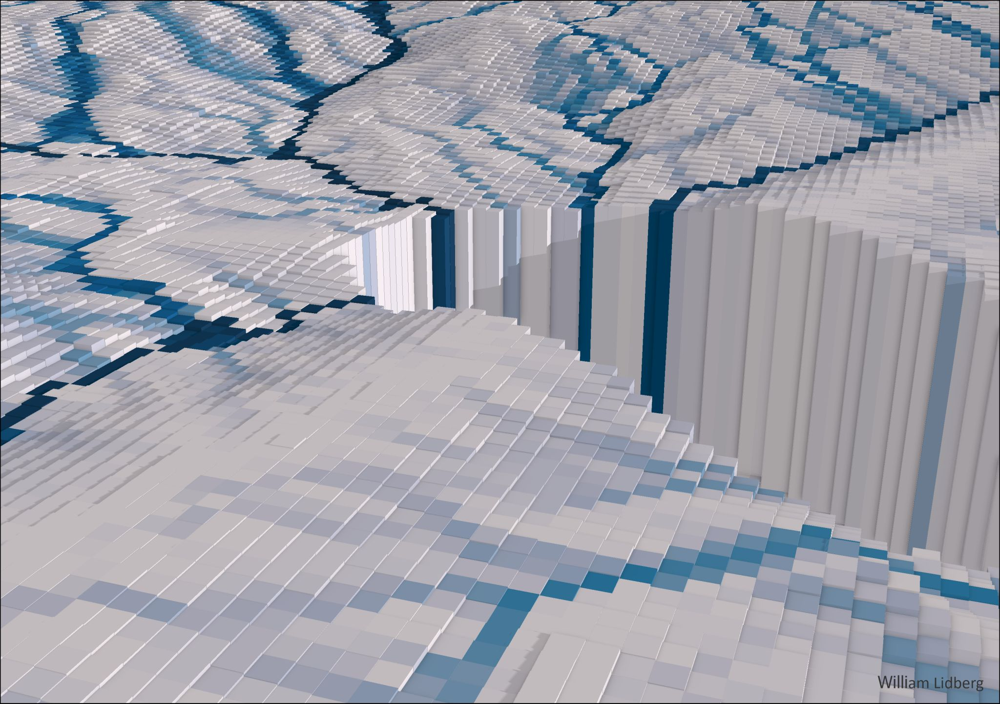

[ LinkedIn](https://www.linkedin.com/in/william-lidberg-9a4842164/)

# DeepBreach

## Detect road culverts with airborne laser scanning and deep learning
Maps have traditionally been constructed from aerial photos, but small stream channels are difficult to observe from the air, especially under a dense tree canopy. Topographical modelling is a widely adopted method for mapping small streams and has been proposed as a potential solution. However, road embankments act like dams in the digital landscape and interrupt flow paths. Therefore, the digital elevation model must undergo adjustments to ensure hydrological accuracy. Here, I demonstrate a method where road culverts are mapped using deep learning so they can be used to correct digital elevation models and improve the accuracy of topographically modelled stream networks. The deep learning model mapped 87 % of all culverts, and incorporating predicted road culverts into the topographical modelling resulted in more accurate stream networks extracted from fine-resolution digital elevation models. 

# Docker

Use this docker image for training and inference: docker pull williamlidberg/deepbreach:v1

Start container and replace -v /mnt/Extension_100TB/William/GitHub/DeepBreach/ with the path to the cloned repository

        docker run -it --rm -v /mnt/Extension_100TB/William/GitHub/DeepBreach/:/workspace/code williamlidberg/deepbreach:v1

Run test inference on a chip. You will need to change the path to the saved weights to the downloaded weights from this repository: 

        python /workspace/code/model/inference.py /workspace/code/data/example/image/ /workspace/code/weights/Attention_ResUNet_combined_97_bs_32_epoch_100.weights.h5 /workspace/code/data/example/inference/binary/ /workspace/code/data/example/inference/vector/

# Data
Training and test data is avalible at this repository:

## Culverts
A very detailed and accurate dataset from Gävleborg where each culvert was mapped in the field with a high precision GPS were used. Both ends of the culvert were digitised and images with a camera. 
The culverts were split into training and testing based on training and testing watersheds. The culvert lines were buffered by 5 meter in each direction before being used to create segmentation masks.

## split raster tiles into image chips
Training and testing data can be downloaded from this repository:

Each of the 5000x5000 pixel tiles were split into smaller image chips with the size 256 x 256 pixels. This corresponds to 128m x 128m in with a 0.5m DEM resolution. Note that 5000x5000 dont split evenly into 256 so the edges were mirrored to correct for that. The splited images will contain alot of empty chips without any culvert pixels. The splitting process also introduces alot of non-zero values in the label images. Therefore only images with resonable amounts of labeled pixels will be keept. This process takes alot of time.

        /workspace/code/split_data_to_chips.sh

## Training
Training and testing was done in the notebook Train_attention_Residual_20240502.ipynb

## Results
Predicted culverts in a small section of the test watersheds. The model captured 87% of all culverts in the test areas (green points). However, the model also produced many false positive predictions (purple points) but only a few false negatives (red points).

## Implementation
Culvert density in the areas of Sweden covered by the ALS data. North-western Sweden was missing ALS data during this study and could not be included. The colours represent the number of detected culverts per square kilometre. Densely populated areas like Gothenburg and Stockholm have a higher culvert density than the more scarcely populated areas in the north.

[alt text](images/figure%204.jpg)

## Conclusions
The deep learning model detected 87 % of the culverts with a recall of 18% so future research should focus on reducing the number of false positives. Burning detected road culverts into DEMs before extracting streams improved the accuracy of extracted stream networks by 17%, and topographically extracted stream networks were more accurate than stream networks on current maps in Sweden.
